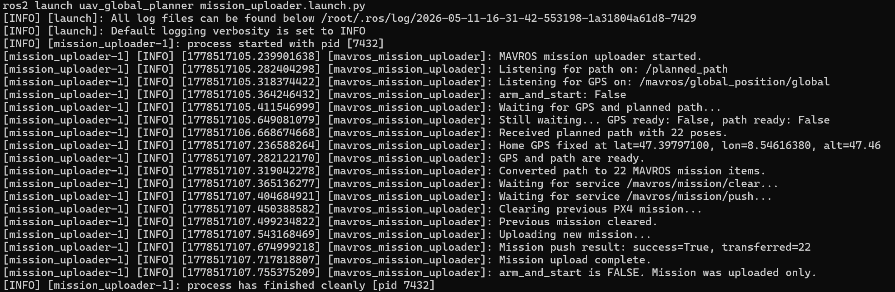
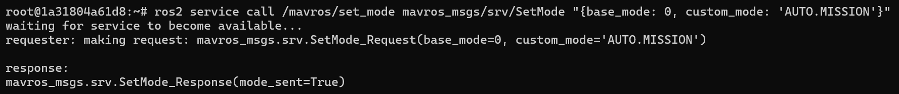
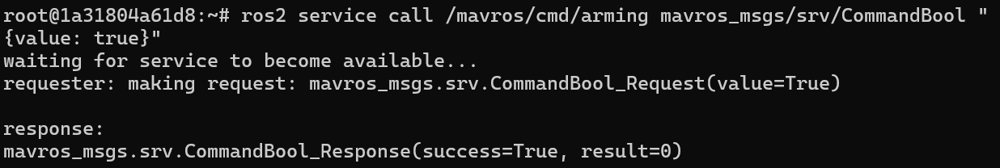
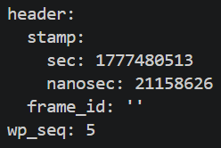
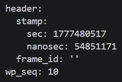
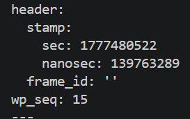
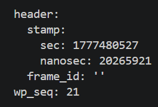

# ROS 2 PX4 Global Planner

Link to repo: https://github.com/ColorfulGoat/lecture9_path_panning_motion_control

This repository contains my solution for **Aufgabe 1: Global Planner — 3D Path Planning**.

The project is based on the provided PX4 simulation environment and adds a custom ROS 2 package called:

```text
uav_global_planner
```

The package implements a simple 3D global planner for a UAV using **A\*** on a **voxel grid**. The generated path is visualized in RViz and uploaded to PX4 SITL as a MAVROS mission.

Aufgabe 2 was optional and was not implemented.

---

## Implementation Overview

The implemented planner includes:

- 3D voxel grid representation
- A* path planning in 3D
- static obstacle boxes
- no-fly-zone boxes
- altitude limits
- RViz visualization
- MAVROS mission upload
- PX4 SITL mission execution in Gazebo

The planner uses a static environment defined in:

```text
ros2_ws/src/uav_global_planner/config/planner.yaml
```

The depth camera / point cloud bridge is not required for this implementation, because the obstacles and no-fly zone are defined directly in the planner configuration.

---

## Main Package

```text
ros2_ws/src/uav_global_planner
```

Important files:

```text
uav_global_planner/
+-- config/
¦   +-- planner.yaml
+-- launch/
¦   +-- planner.launch.py
¦   +-- mission_uploader.launch.py
+-- uav_global_planner/
    +-- voxel_grid.py
    +-- astar_3d.py
    +-- global_planner_node.py
    +-- mavros_mission_node.py
```

---

## ROS 2 Nodes

### `global_planner`

This node:

- loads the configuration from `planner.yaml`
- builds the 3D voxel grid
- marks obstacles and no-fly zones as occupied
- runs A*
- publishes the planned path and RViz markers

Published topics:

```text
/planned_path
/planning_markers
```

### `mission_uploader`

This node:

- subscribes to `/planned_path`
- receives GPS data from MAVROS
- converts local waypoints into approximate GPS mission waypoints
- clears the old PX4 mission
- uploads the new mission to PX4

Used MAVROS services:

```text
/mavros/mission/clear
/mavros/mission/push
/mavros/mission/pull
/mavros/set_mode
/mavros/cmd/arming
```

---

## Build

Start the container:

```bash
docker compose up -d
```

Enter the container:

```bash
docker exec -it px4_sitl bash
```

Build the planner package:

```bash
cd /root/ros2_ws
source /opt/ros/jazzy/setup.bash
colcon build --packages-select uav_global_planner
source install/setup.bash
```

Check executables:

```bash
ros2 pkg executables uav_global_planner
```

Expected:

```text
uav_global_planner global_planner
uav_global_planner mission_uploader
```

---

## Run Demo

### 1. Start PX4 SITL with lightweight Gazebo model

```bash
docker exec -it px4_sitl bash
cd /root/PX4-Autopilot
make px4_sitl gz_x500
```

The lightweight `gz_x500` model is used because Gazebo through NoVNC was slow with heavier worlds/models.

---

### 2. Start MAVROS

```bash
docker exec -it px4_sitl bash
source /opt/ros/jazzy/setup.bash
ros2 launch mavros px4.launch fcu_url:=udp://:14540@localhost:14557
```

Check connection:

```bash
ros2 topic echo /mavros/state --once
```

Expected:

```text
connected: true
```

---

### 3. Start the planner

```bash
docker exec -it px4_sitl bash
source /opt/ros/jazzy/setup.bash
source /root/ros2_ws/install/setup.bash
ros2 launch uav_global_planner planner.launch.py
```

Expected output includes:

```text
Running 3D A* planner...
A* planning successful.
```

---

### 4. Visualize in RViz

Inside the NoVNC desktop:

```bash
source /opt/ros/jazzy/setup.bash
source /root/ros2_ws/install/setup.bash
rviz2
```

In RViz:

```text
Fixed Frame: map
Path topic: /planned_path
MarkerArray topic: /planning_markers
```

RViz shows:

- green line: planned path
- red boxes: obstacles
- purple box: no-fly zone
- blue sphere: start
- yellow sphere: goal

---

### 5. Upload the mission

```bash
docker exec -it px4_sitl bash
source /opt/ros/jazzy/setup.bash
source /root/ros2_ws/install/setup.bash
ros2 launch uav_global_planner mission_uploader.launch.py
```

Expected output:

```text
Mission push result: success=True
Mission upload complete.
```

Verify:

```bash
ros2 service call /mavros/mission/pull mavros_msgs/srv/WaypointPull "{}"
```

Expected:

```text
success=True
wp_received=...
```

---

### 6. Start mission execution

Set mission mode first:

```bash
ros2 service call /mavros/set_mode mavros_msgs/srv/SetMode "{base_mode: 0, custom_mode: 'AUTO.MISSION'}"
```

Then arm:

```bash
ros2 service call /mavros/cmd/arming mavros_msgs/srv/CommandBool "{value: true}"
```

Check state:

```bash
ros2 topic echo /mavros/state --once
```

Expected:

```text
mode: AUTO.MISSION
armed: true
connected: true
```

Monitor waypoint progress:

```bash
ros2 topic echo /mavros/mission/reached
```

---

## Drone Footage


## Results

## Demo Results

The following screenshots show the complete mission pipeline: the generated path is uploaded to PX4 through MAVROS, PX4 is switched into mission mode, the UAV is armed, and the mission progresses through the planned waypoints.

<table>
  <tr>
    <th>Step</th>
    <th>Screenshot</th>
    <th>What it shows</th>
  </tr>

  <tr>
    <td><b>1. Mission upload</b></td>
    <td></td>
    <td>
      The <code>mission_uploader</code> node receives the planned path with 22 poses, receives the GPS home position, converts the path into 22 MAVROS mission items, clears the previous PX4 mission, and uploads the new mission successfully. The important confirmation is <code>Mission push result: success=True, transferred=22</code>.
    </td>
  </tr>

  <tr>
    <td><b>2. Mission mode command</b></td>
    <td></td>
    <td>
      PX4 is switched into <code>AUTO.MISSION</code> mode using the MAVROS <code>/mavros/set_mode</code> service. The response <code>mode_sent=True</code> confirms that the mission mode command was accepted by MAVROS and sent to PX4.
    </td>
  </tr>

  <tr>
    <td><b>3. UAV armed</b></td>
    <td></td>
    <td>
      The UAV is armed using the MAVROS <code>/mavros/cmd/arming</code> service. The response <code>success=True</code> confirms that the simulated vehicle was successfully armed and ready to execute the uploaded mission.
    </td>
  </tr>

  <tr>
    <td><b>4. Waypoint 5 reached</b></td>
    <td></td>
    <td>
      The topic <code>/mavros/mission/reached</code> reports <code>wp_seq: 5</code>, showing that the UAV has started executing the mission and reached waypoint 5.
    </td>
  </tr>

  <tr>
    <td><b>5. Waypoint 10 reached</b></td>
    <td></td>
    <td>
      The mission continues successfully. The UAV reaches waypoint 10, confirming that it is progressing through the uploaded path rather than remaining at the start.
    </td>
  </tr>

  <tr>
    <td><b>6. Waypoint 15 reached</b></td>
    <td></td>
    <td>
      The UAV reaches waypoint 15. This shows continued mission execution through the intermediate planned waypoints generated by the 3D A* planner.
    </td>
  </tr>

  <tr>
    <td><b>7. Final waypoint reached</b></td>
    <td></td>
    <td>
      The mission reaches <code>wp_seq: 21</code>. Since the uploaded mission contains 22 waypoints, indexed from 0 to 21, this confirms that the UAV reached the final waypoint of the planned mission.
    </td>
  </tr>
</table>

## Notes

The final demo uses the lightweight `gz_x500` model. The planner itself does not depend on Gazebo depth-camera data. It uses a static voxel map from `planner.yaml`, so the depth-camera bridge is not required.

Generated ROS 2 folders are ignored and should not be committed:

```text
ros2_ws/build
ros2_ws/install
ros2_ws/log
```

---

## Summary

This project implements a complete minimal global-planning pipeline:

```text
3D voxel grid
? A* global planner
? RViz visualization
? MAVROS mission upload
? PX4 AUTO.MISSION execution in Gazebo
```
